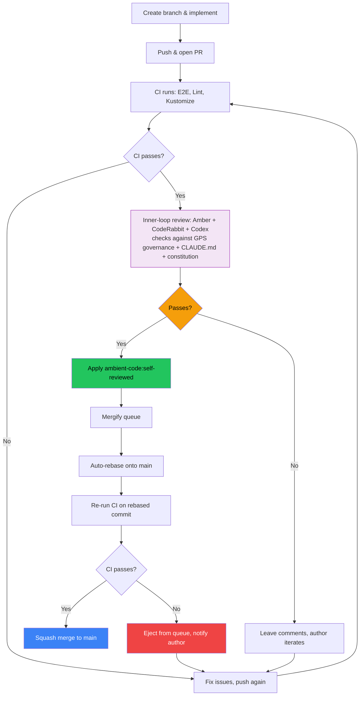

# ADR-0008: Automate Code Reviews

**Date:** 2026-04-10
**Deciders:** Jeremy Eder, Platform Team
**Technical Story:** Recurring Friday release bottleneck — 44 open PRs, cascading merge conflicts, 10-minute CI cycles, human review as the blocking gate.

## Context and Problem Statement

Human code review is the single largest bottleneck in the ambient-code/platform release cycle:

- **44 open PRs** accumulate during the week with no review activity.
- **No auto-rebase** — PRs go stale against main. By Friday, most have merge conflicts.
- **Cascading conflicts** — merging one PR invalidates others. Each rebase triggers a 10-minute CI cycle.
- **Mergify is configured but underutilized** — it requires human approval before acting, making it a gate rather than an accelerator.

The goal is to replace human code review with automated confidence layers that provide equal or better quality assurance.

## Decision Drivers

* Release velocity — ship daily, not batch merges into a Friday triage session
* Existing infrastructure — Mergify, Amber, E2E tests, lint, kustomize checks already run on every PR
* Author accountability — authors doing self-reflect loops with AI assistants already catch most issues
* Conflict cascade cost — every human delay multiplies into CI re-runs and rebases

## Considered Options

* **Option A: Status quo** — keep requiring human approvals, improve the triage dashboard
* **Option B: Reduce approval requirements** — 1 approval for all PRs, auto-approve bots
* **Option C: Automate reviews** — replace with automated confidence stack + self-reviewed label

## Decision Outcome

Chosen option: **Option C** — automate code reviews with a confidence stack and self-reviewed label.

An automated inner-loop review checks each PR against repo and org governance. When it passes, the `ambient-code:self-reviewed` label is applied. When that label is present and CI passes, Mergify merges the PR with no human approval required.

### How It Works

**Step 1: CI (already exists).** Every push runs E2E tests, lint, and kustomize checks.

**Step 2: Inner-loop review (new).** A single function — implemented as a skill, hook, or GHA step — orchestrates review agents (Amber, CodeRabbit, Codex) and checks the PR against governance docs pulled from GPS (`list_documents`, `get_document`) and repo-level docs (CLAUDE.md, BOOKMARKS.md, constitution). If all checks pass, it applies the `ambient-code:self-reviewed` label. If any fail, it leaves comments and the author iterates.

**Step 3: Merge queue (reconfigured).** Mergify picks up labeled PRs, auto-rebases onto main, re-runs CI on the rebased commit, and squash-merges if green. PRs without the label still follow the traditional approval path.

The `ambient-code:self-reviewed` label joins the existing namespace (`auto-fix`, `managed`, `needs-human`). It is machine-applied by the inner-loop review, though any contributor with write access can also apply it as an escape hatch.

Policy changes in GPS or CLAUDE.md propagate to every future review without updating CI workflows.

### PR Lifecycle Flow



### Consequences

**Positive:**

* PRs merge continuously throughout the week instead of piling up for Friday
* Auto-rebase keeps PRs current with main, preventing the conflict cascade
* Governance enforcement is automatic — policy changes propagate to all future reviews
* The traditional approval path still exists as a fallback

**Negative:**

* Inner-loop review quality depends on governance doc quality — requires ongoing investment in CLAUDE.md, constitution, GPS content
* If someone applies the label manually without running the inner-loop, CI is the only remaining gate

**Risks:**

* Auto-rebase at scale could overwhelm CI — mitigated by: Mergify rate-limits rebases, stale draft cleanup reduces PR count

## Implementation

1. Create `ambient-code:self-reviewed` label in the GitHub repo
2. Build the inner-loop review function (skill/hook/GHA) that checks PRs against GPS governance docs + repo conventions
3. Replace `.mergify.yml` with the configuration in [Appendix A](#appendix-a-mergify-configuration)
4. Enable branch protection on `main` requiring status checks (currently unprotected)
5. Remove or simplify `dependabot-auto-merge.yml` (Mergify now handles this)
6. Communicate the new workflow to the team

## Validation

* Median PR age at merge drops from >7 days to <1 day
* Releases happen daily without manual merge sessions
* No increase in revert rate on main
* Open PR count drops below 20

---

## Appendix A: Mergify Configuration

```yaml
queue_rules:
  - name: urgent
    autoqueue: true
    merge_method: squash
    queue_conditions:
      - "label=hotfix"
      - "#changes-requested-reviews-by=0"
      - check-success=End-to-End Tests
      - check-success=validate-manifests
      - check-success=test-local-dev-simulation

  - name: self-reviewed
    autoqueue: true
    merge_method: squash
    queue_conditions:
      - "label=ambient-code:self-reviewed"
      - "#changes-requested-reviews-by=0"
      - check-success=End-to-End Tests
      - check-success=validate-manifests
      - check-success=test-local-dev-simulation

  - name: default
    autoqueue: true
    merge_method: squash
    queue_conditions:
      - "#approved-reviews-by>=1"
      - "#changes-requested-reviews-by=0"
      - check-success=End-to-End Tests
      - check-success=validate-manifests
      - check-success=test-local-dev-simulation

pull_request_rules:
  - name: auto-rebase PRs
    conditions:
      - -draft
      - -conflict
      - base=main
    actions:
      update: {}

  - name: queue hotfixes
    conditions:
      - "label=hotfix"
    actions:
      queue:
        name: urgent

  - name: queue self-reviewed PRs
    conditions:
      - "label=ambient-code:self-reviewed"
      - -draft
      - -conflict
      - "label!=hotfix"
    actions:
      queue:
        name: self-reviewed

  - name: queue remaining PRs
    conditions:
      - -draft
      - -conflict
      - "label!=hotfix"
      - "label!=ambient-code:self-reviewed"
    actions:
      queue:
        name: default

  - name: warn stale drafts
    conditions:
      - draft
      - "updated-at<30 days ago"
    actions:
      comment:
        message: |
          This draft PR has had no activity for 30 days. It will be
          automatically closed in 30 days if there is no further activity.

  - name: close abandoned drafts
    conditions:
      - draft
      - "updated-at<60 days ago"
    actions:
      close:
        message: |
          Closing this draft PR due to 60 days of inactivity.
          The branch has not been deleted — reopen if work resumes.
```
